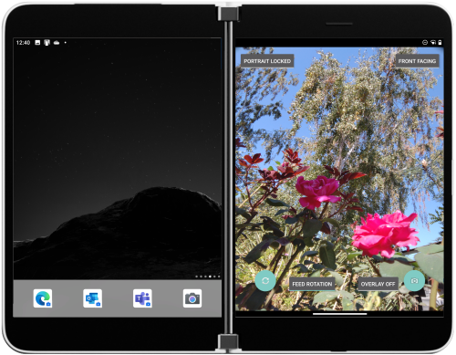

# Camera sample app for Surface Duo

This sample and accompanying [blog post](https://devblogs.microsoft.com/surface-duo/dual-screen-camera-sample/) show how to code your app to handle difference camera scenarios including:

- Ensuring a good user experience when your app is orientation-locked (to portrait or landscape)
- Rotating the camera feed as the device rotates
- Adjusting the camera feed aspect ratio to fit each device posture

If you prefer to use the newer CameraX library, visit the [Android camera-samples repo](https://github.com/android/camera-samples/tree/master/CameraXBasic).

## Related links

- [Camera on Surface Duo docs](https://docs.microsoft.com/dual-screen/android/platform/camera)
- [Working with the camera blog post](https://devblogs.microsoft.com/surface-duo/dual-screen-camera-sample/)
- [CameraXBasic sample](https://github.com/android/camera-samples/tree/master/CameraXBasic) and [CameraX API reference](https://developer.android.com/training/camerax)
- [Get the Surface Duo emulator](https://docs.microsoft.com/dual-screen/android/emulator/)
