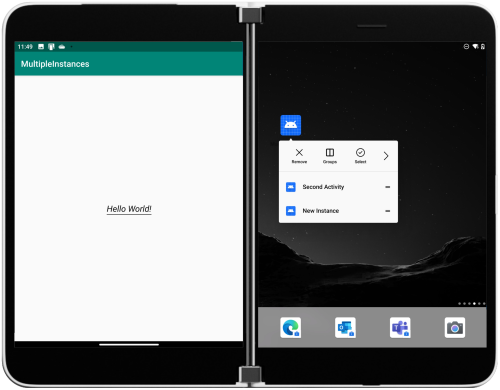
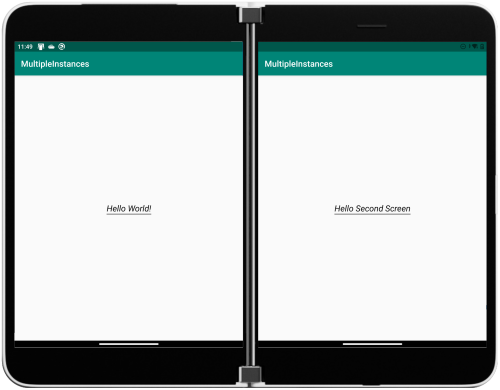

# Multiple instances sample for Surface Duo

Android allows your app to start another instance - Microsoft Edge on the Surface Duo can be opened twice to have two different browsing sessions. To test with the sample, long-tap to show the shortcut menu:



Two instances can run side-by-side:



This code sets the correct intent flags in the shortcut menu to enable the behavior:

```java
Intent intent = new Intent(Intent.ACTION_MAIN, Uri.EMPTY, this, MainActivity.class);
intent.addFlags(Intent.FLAG_ACTIVITY_MULTIPLE_TASK | Intent.FLAG_ACTIVITY_SINGLE_TOP);

Intent intent2 = new Intent(Intent.ACTION_MAIN, Uri.EMPTY, this, SecondActivity.class);
intent.addFlags(Intent.FLAG_ACTIVITY_MULTIPLE_TASK | Intent.FLAG_ACTIVITY_SINGLE_TOP);

ShortcutManager shortcutManager = getSystemService(ShortcutManager.class);

ShortcutInfo shortcut = new ShortcutInfo.Builder(this, "id1")
        .setShortLabel("New Instance")
        .setLongLabel("New Instance")
        .setIntent(intent)
        .build();

ShortcutInfo shortcut2 = new ShortcutInfo.Builder(this, "id2")
        .setShortLabel("Second Activity")
        .setLongLabel("Second Activity")
        .setIntent(intent2)
        .build();

if (shortcutManager != null) {
    shortcutManager.setDynamicShortcuts(Arrays.asList(shortcut, shortcut2));
}
```

## Related links

- [Introduction to dual-screen devices](https://docs.microsoft.com/dual-screen/introduction)
- [Get the Surface Duo emulator](https://docs.microsoft.com/dual-screen/android/emulator/)
