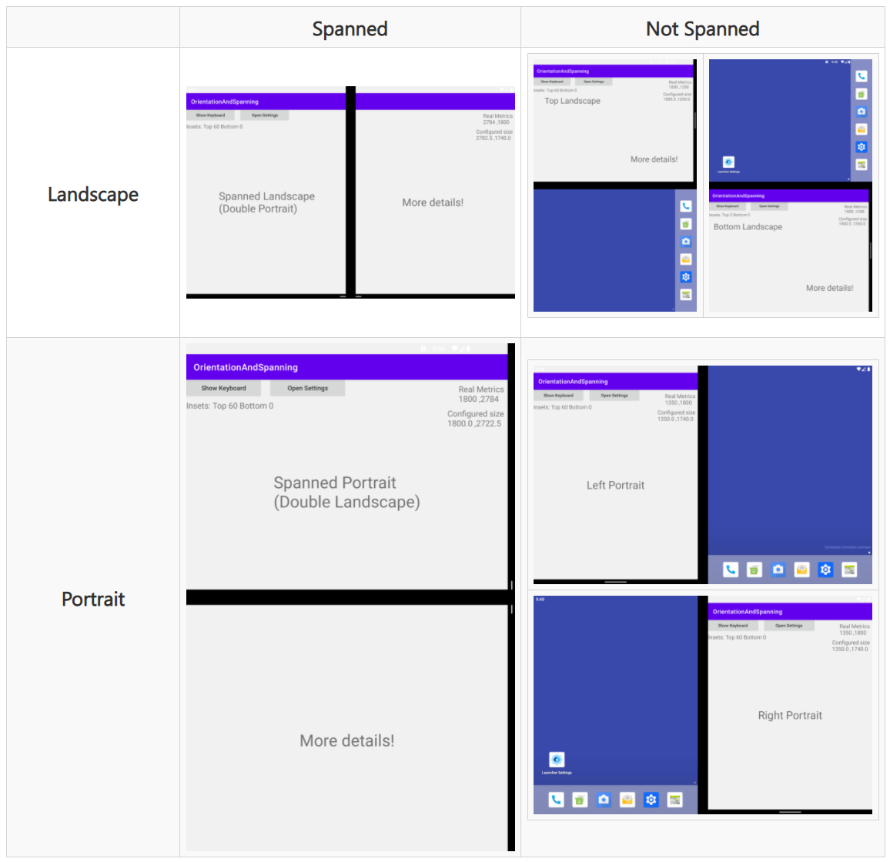

# Orientation and spanning sample app for Surface Duo

This sample provides practical code snippets for detecting orientation and spanned-state changes, and updating layouts when the keyboard appears.

## Related links

- [Orientation changes on Surface Duo docs](https://docs.microsoft.com/dual-screen/android/platform/orientation)
- [Orientation, Spanning, and Insets blog post](https://devblogs.microsoft.com/surface-duo/orientation-spanning-and-insets/)
- [Get the Surface Duo emulator](https://docs.microsoft.com/dual-screen/android/emulator/)
