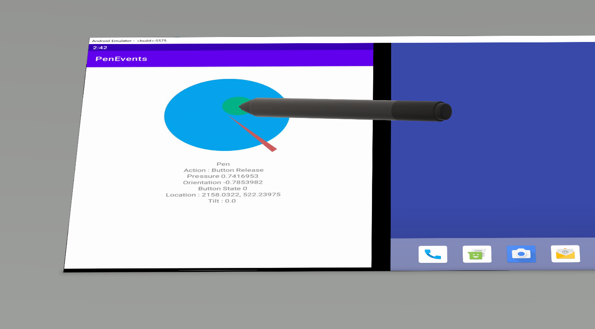
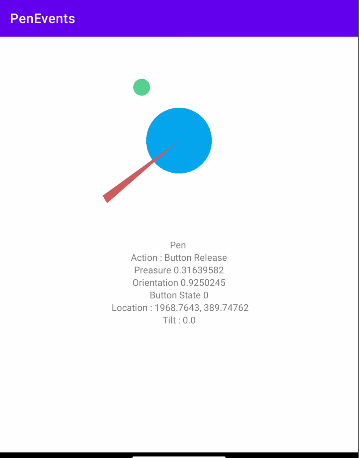
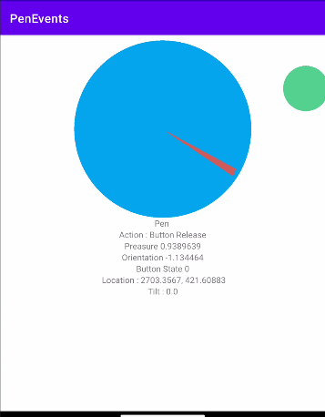
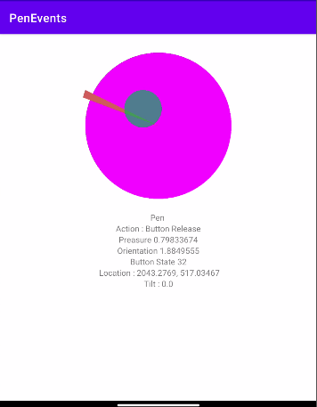
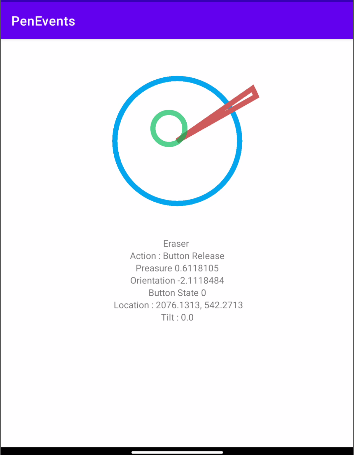

# Pen events sample app for Surface Duo

This sample contains code to visualize events raised when using a Surface Pen with the Surface Duo. More information is available in the [accompanying blog post](https://devblogs.microsoft.com/surface-duo/pen-events-on-the-surface-duo/).

Different pen states detected by the sample:

- The green circle represents the point under the pen tip; its size is controlled by the pressure
- The blue circle size represents the pressure; it will turn pink if the button is pressed
- The red triangle represents the orientation
- If an eraser is used, the shapes will become outlines

|||||
|-|-|-|-|
|  |  |  |  |
| Pen with low pressure | Pen with high pressure | Pen with the barrel button pressed | Pen held upside down with the eraser on the screen |

## Related links

- [Pen input on Surface Duo docs](https://docs.microsoft.com/dual-screen/android/platform/pen)
- [Pen events blog post](https://devblogs.microsoft.com/surface-duo/pen-events-on-the-surface-duo/)
- [Get the Surface Duo emulator](https://docs.microsoft.com/dual-screen/android/emulator/)

This sample is also available in [Kotlin](https://github.com/microsoft/surface-duo-sdk-samples-kotlin/tree/master/PenEvents).
